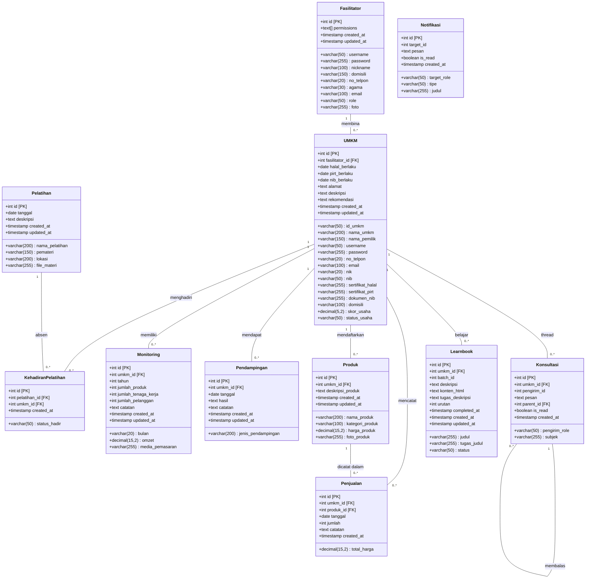

# Class Diagram & Kamus Data Sistem UMKM

Dokumen ini berisi struktur entitas sistem UMKM, direpresentasikan melalui Mermaid Class Diagram (dengan informasi tipe data dan panjang/width), serta dijabarkan secara detail dalam bentuk tabel (Kamus Data).

## 1. Class Diagram

---

## 2. Struktur Tabel Entitas (Kamus Data)

Berikut rincian setiap tabel dan panjang (*width*) setiap field sesuai dengan struktur *database*.

### 1. Tabel `fasilitator`
| Nama Field | Tipe Data | Panjang (Width) | Keterangan |
| :--- | :--- | :--- | :--- |
| `id` | SERIAL / INT | 4 Bytes | Primary Key |
| `username` | VARCHAR | 50 | UNIQUE, username login |
| `password` | VARCHAR | 255 | Password terenkripsi |
| `nickname` | VARCHAR | 100 | Nama panggilan fasilitator |
| `domisili` | VARCHAR | 150 | Alamat/domisili |
| `no_telpon` | VARCHAR | 20 | Nomor kontak |
| `agama` | VARCHAR | 30 | - |
| `email` | VARCHAR | 100 | - |
| `role` | VARCHAR | 50 | Default 'Staff'. Check IN ('Admin', 'Staff') |
| `foto` | VARCHAR | 255 | URL/Path foto profil |
| `permissions` | TEXT[] | Array | Hak akses modular staff |
| `created_at` | TIMESTAMP | 8 Bytes | - |
| `updated_at` | TIMESTAMP | 8 Bytes | - |

### 2. Tabel `umkm`
| Nama Field | Tipe Data | Panjang (Width) | Keterangan |
| :--- | :--- | :--- | :--- |
| `id` | SERIAL / INT | 4 Bytes | Primary Key |
| `id_umkm` | VARCHAR | 50 | UNIQUE, Manual ID UMKM |
| `fasilitator_id` | INT | 4 Bytes | Foreign Key -> `fasilitator(id)` |
| `nama_umkm` | VARCHAR | 200 | Nama usaha |
| `nama_pemilik` | VARCHAR | 150 | Nama pemilik usaha |
| `username` | VARCHAR | 50 | UNIQUE, username login UMKM |
| `password` | VARCHAR | 255 | Password terenkripsi |
| `no_telpon` | VARCHAR | 20 | - |
| `email` | VARCHAR | 100 | - |
| `nik` | VARCHAR | 20 | NIK Pemilik |
| `nib` | VARCHAR | 50 | Nomor Induk Berusaha |
| `sertifikat_halal` | VARCHAR | 255 | URL/Path dokumen halal |
| `halal_berlaku` | DATE | 4 Bytes | Tanggal kedaluwarsa sertifikat |
| `sertifikat_pirt` | VARCHAR | 255 | URL/Path dokumen PIRT |
| `pirt_berlaku` | DATE | 4 Bytes | Tanggal kedaluwarsa PIRT |
| `dokumen_nib` | VARCHAR | 255 | URL/Path file dokumen NIB |
| `nib_berlaku` | DATE | 4 Bytes | Tanggal kedaluwarsa NIB |
| `alamat` | TEXT | Unlimited | Alamat detail |
| `domisili` | VARCHAR | 100 | - |
| `deskripsi` | TEXT | Unlimited | Penjelasan mengenai usaha |
| `skor_usaha` | DECIMAL | (5,2) | Angka total poin leaderboard/scoring |
| `status_usaha` | VARCHAR | 50 | Status misal: Pemula, Go Modern, dst |
| `rekomendasi` | TEXT | Unlimited | Rekomendasi otomatis AI |
| `created_at` | TIMESTAMP | 8 Bytes | - |
| `updated_at` | TIMESTAMP | 8 Bytes | - |

### 3. Tabel `pelatihan`
| Nama Field | Tipe Data | Panjang (Width) | Keterangan |
| :--- | :--- | :--- | :--- |
| `id` | SERIAL / INT | 4 Bytes | Primary Key |
| `nama_pelatihan` | VARCHAR | 200 | Topik/Judul pelatihan |
| `tanggal` | DATE | 4 Bytes | - |
| `pemateri` | VARCHAR | 150 | Nama narasumber |
| `lokasi` | VARCHAR | 200 | Tempat/Platform (Online/Offline) |
| `deskripsi` | TEXT | Unlimited | - |
| `file_materi` | VARCHAR | 255 | URL/Path dokumen materi pdf/ppt |
| `created_at` | TIMESTAMP | 8 Bytes | - |
| `updated_at` | TIMESTAMP | 8 Bytes | - |

### 4. Tabel `kehadiran_pelatihan`
| Nama Field | Tipe Data | Panjang (Width) | Keterangan |
| :--- | :--- | :--- | :--- |
| `id` | SERIAL / INT | 4 Bytes | Primary Key |
| `pelatihan_id` | INT | 4 Bytes | Foreign Key -> `pelatihan(id)` |
| `umkm_id` | INT | 4 Bytes | Foreign Key -> `umkm(id)` |
| `status_hadir` | VARCHAR | 50 | Check IN ('hadir', 'tidak_hadir', 'izin') |
| `created_at` | TIMESTAMP | 8 Bytes | - |

### 5. Tabel `monitoring`
| Nama Field | Tipe Data | Panjang (Width) | Keterangan |
| :--- | :--- | :--- | :--- |
| `id` | SERIAL / INT | 4 Bytes | Primary Key |
| `umkm_id` | INT | 4 Bytes | Foreign Key -> `umkm(id)` |
| `bulan` | VARCHAR | 20 | - |
| `tahun` | INT | 4 Bytes | - |
| `omzet` | DECIMAL | (15,2) | Pendapatan per bulan |
| `jumlah_produk` | INT | 4 Bytes | Varian produk yg dimiliki bulan ini |
| `jumlah_tenaga_kerja`| INT | 4 Bytes | Jumlah pekerja |
| `jumlah_pelanggan` | INT | 4 Bytes | Jumlah pelanggan bulanan |
| `media_pemasaran` | VARCHAR | 255 | Misal: IG, Tokopedia |
| `catatan` | TEXT | Unlimited | - |
| `created_at` | TIMESTAMP | 8 Bytes | - |
| `updated_at` | TIMESTAMP | 8 Bytes | - |

### 6. Tabel `pendampingan`
| Nama Field | Tipe Data | Panjang (Width) | Keterangan |
| :--- | :--- | :--- | :--- |
| `id` | SERIAL / INT | 4 Bytes | Primary Key |
| `umkm_id` | INT | 4 Bytes | Foreign Key -> `umkm(id)` |
| `tanggal` | DATE | 4 Bytes | - |
| `jenis_pendampingan`| VARCHAR | 200 | Kategori pendampingan |
| `hasil` | TEXT | Unlimited | - |
| `catatan` | TEXT | Unlimited | - |
| `created_at` | TIMESTAMP | 8 Bytes | - |
| `updated_at` | TIMESTAMP | 8 Bytes | - |

### 7. Tabel `produk`
| Nama Field | Tipe Data | Panjang (Width) | Keterangan |
| :--- | :--- | :--- | :--- |
| `id` | SERIAL / INT | 4 Bytes | Primary Key |
| `umkm_id` | INT | 4 Bytes | Foreign Key -> `umkm(id)` |
| `nama_produk` | VARCHAR | 200 | - |
| `kategori_produk` | VARCHAR | 100 | Makanan, Minuman, Kriya, dll |
| `harga_produk` | DECIMAL | (15,2) | - |
| `deskripsi_produk` | TEXT | Unlimited | - |
| `foto_produk` | VARCHAR | 255 | URL/Path foto |
| `created_at` | TIMESTAMP | 8 Bytes | - |
| `updated_at` | TIMESTAMP | 8 Bytes | - |

### 8. Tabel `penjualan`
| Nama Field | Tipe Data | Panjang (Width) | Keterangan |
| :--- | :--- | :--- | :--- |
| `id` | SERIAL / INT | 4 Bytes | Primary Key |
| `umkm_id` | INT | 4 Bytes | Foreign Key -> `umkm(id)` |
| `produk_id` | INT | 4 Bytes | Foreign Key -> `produk(id)` |
| `tanggal` | DATE | 4 Bytes | - |
| `jumlah` | INT | 4 Bytes | Jumlah item yang terjual |
| `total_harga` | DECIMAL | (15,2) | Harga X Jumlah |
| `catatan` | TEXT | Unlimited | - |
| `created_at` | TIMESTAMP | 8 Bytes | - |

### 9. Tabel `konsultasi`
| Nama Field | Tipe Data | Panjang (Width) | Keterangan |
| :--- | :--- | :--- | :--- |
| `id` | SERIAL / INT | 4 Bytes | Primary Key |
| `umkm_id` | INT | 4 Bytes | Foreign Key -> `umkm(id)` |
| `pengirim_role` | VARCHAR | 50 | 'Admin', 'Staff', atau 'Mitra' |
| `pengirim_id` | INT | 4 Bytes | ID user dari sender |
| `subjek` | VARCHAR | 255 | Judul/Topik konsultasi |
| `pesan` | TEXT | Unlimited | Isi konsultasi |
| `parent_id` | INT | 4 Bytes | Foreign Key -> `konsultasi(id)` untuk sistem balasan thread |
| `is_read` | BOOLEAN | 1 Byte | Status sudah dibaca atau belum |
| `created_at` | TIMESTAMP | 8 Bytes | - |

### 10. Tabel `notifikasi`
| Nama Field | Tipe Data | Panjang (Width) | Keterangan |
| :--- | :--- | :--- | :--- |
| `id` | SERIAL / INT | 4 Bytes | Primary Key |
| `target_role` | VARCHAR | 50 | Tujuan ('Admin', 'Staff', 'Mitra') |
| `target_id` | INT | 4 Bytes | ID penerima |
| `tipe` | VARCHAR | 50 | 'naik_kelas', 'sertifikasi_expired', 'info', 'chat' |
| `judul` | VARCHAR | 255 | Judul notif |
| `pesan` | TEXT | Unlimited | - |
| `is_read` | BOOLEAN | 1 Byte | - |
| `created_at` | TIMESTAMP | 8 Bytes | - |

### 11. Tabel `learnbook`
| Nama Field | Tipe Data | Panjang (Width) | Keterangan |
| :--- | :--- | :--- | :--- |
| `id` | SERIAL / INT | 4 Bytes | Primary Key |
| `umkm_id` | INT | 4 Bytes | Foreign Key -> `umkm(id)` |
| `batch_id` | INT | 4 Bytes | - |
| `judul` | VARCHAR | 255 | - |
| `deskripsi` | TEXT | Unlimited | - |
| `konten_html` | TEXT | Unlimited | Konten bacaan format HTML |
| `tugas_judul` | VARCHAR | 255 | - |
| `tugas_deskripsi` | TEXT | Unlimited | - |
| `urutan` | INT | 4 Bytes | Urutan modul (1, 2, 3...) |
| `status` | VARCHAR | 50 | 'locked', 'active', 'completed' |
| `completed_at` | TIMESTAMP | 8 Bytes | Kapan diselesaikan |
| `created_at` | TIMESTAMP | 8 Bytes | - |
| `updated_at` | TIMESTAMP | 8 Bytes | - |
